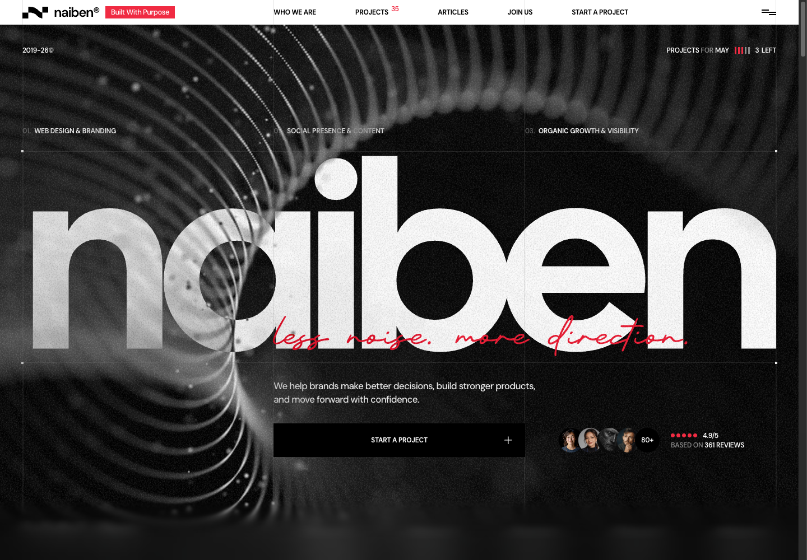

# Neiden Konsept

[Neiden](https://neiden.framer.media/) sitesinin tasarımını, özgün görsellerini, geçişlerini ve scroll animasyonlarını React ile bölüm bölüm yeniden geliştirme projesi. Uygulama planı Astra ile hazırlandı; geliştirme, referans incelemesi ve bağımsız QA için ajan rolleri tanımlandı.

Uygulamada kullanılan marka adı **naiben**. Ortak marka metinleri [src/content/brand.ts](src/content/brand.ts) dosyasında tutulur.

**Geliştirme devam ediyor.** Ana sayfanın ilk bölümleri tamamlandı; tüm bölüm ve iç sayfaların görsel ve hareket eşleşmesi henüz bitmedi.

[Canlı site](https://neiden-konsept.vercel.app/) · [Referans site](https://neiden.framer.media/) · [GitHub reposu](https://github.com/omergungor11/neiden-konsept) · [Uygulama planı](docs/IMPLEMENTATION_PLAN.md) · [Görev kuyruğu](docs/TASKS.json)



## Kurulum

Node.js 22 ve npm kullanılır. Doğrulanan geliştirme ortamı: Node.js **22.22.3**, npm **10.9.8**. Asset türevlerini yeniden üretmek için ayrıca Python 3 gerekir.

```bash
git clone https://github.com/omergungor11/neiden-konsept.git
cd neiden-konsept
npm ci
npm run dev
```

Geliştirme sunucusu: [http://127.0.0.1:5173/](http://127.0.0.1:5173/). Orijinal medya, yerel font tanımları ve uygulama asset katalogları repoda bulunur; ilk çalıştırmada asset hazırlama komutunu çalıştırmak gerekmez.

Üretim çıktısını yerelde incelemek için:

```bash
npm run build
npm run preview
```

Önizleme varsayılan olarak [http://127.0.0.1:4173/](http://127.0.0.1:4173/) adresinde açılır. Build çıktısı `dist/` dizinine yazılır.

## Vercel yayını

Canlı adres: **[neiden-konsept.vercel.app](https://neiden-konsept.vercel.app/)**.

[Vercel projesi](https://vercel.com/pitonworks-projects/neiden-konsept), GitHub'daki `omergungor11/neiden-konsept` reposuna bağlıdır. `main` dalına gönderilen commit'ler otomatik olarak production ortamına deploy edilir. İlk GitHub deploy'u, `naiben` marka güncellemesini içeren `e0997cb` commit'iyle doğrulandı.

Proje Node.js `22.x`, Vite, `npm ci`, `npm run build` ve `dist` çıktı dizinini kullanır. [vercel.json](vercel.json) içindeki SPA rewrite, iç adreslerin doğrudan açıldığında React Router'a ulaşmasını sağlar. Yerel `.vercel/` bağlantı dosyaları Git'e dahil edilmez.

## Komutlar

| Komut | İşlev |
| --- | --- |
| `npm run dev` | Vite geliştirme sunucusunu başlatır. |
| `npm run typecheck` | TypeScript tip kontrolünü çalıştırır. |
| `npm run build` | Tip kontrolünden sonra üretim build'i oluşturur. |
| `npm run preview` | Oluşturulmuş build'i yerelde sunar. |
| `npm run assets:prepare` | Yerel font CSS'i, asset katalogları ve bağımlılıkları tamamlanmış SVG türevlerini üretir. |
| `npm run plan:validate` | Görev grafiğini, kanıt dosyalarını ve arşivdeki asset hash'lerini doğrular. |

Plan doğrulaması ve başarılı build, görsel veya animasyon eşleşmesinin tamamlandığı anlamına gelmez. Bölüm kabulü için tarayıcı karşılaştırmaları ve ayrı QA kayıtları kullanılır.

## Teknolojiler

| Alan | Kullanılan araçlar |
| --- | --- |
| Uygulama | React 19, TypeScript 7, Vite 8 |
| Rotalar | React Router 7 |
| Smooth scroll | Lenis |
| Animasyon ve scroll tetikleyicileri | GSAP, ScrollTrigger |
| Kaynak spring eğrileri | Motion DOM generator API |
| Görsel doğrulama araçları | agent-browser 0.27.0, özel DOM ve screenshot scriptleri |
| Asset hazırlama | Python 3 |

Kesin paket sürümleri [package.json](package.json) ve [package-lock.json](package-lock.json) içinde tutulur.

## Mevcut durum

| Görev / bölüm | Durum |
| --- | --- |
| F00 — Referans, rota ve medya arşivi | Doğrulandı. |
| F01 — Uygulama ve motion temeli | Doğrulandı. |
| S00 — Header, menü, footer ve ortak efektler | Bağımsız QA tamamlandı. |
| H01 — Hero | Bölüm QA'sı tamamlandı. |
| H02 — About | Bölüm QA'sı tamamlandı. |
| H03 — Services | Bölüm QA'sı tamamlandı. |
| H04 — Portfolio | Ana sayfaya entegre; geometri, motion ve responsive QA sürüyor. |
| H05 — More Cases | İlk uygulaması hazır; H04 QA sonrası entegre edilecek. |
| Diğer ana sayfa bölümleri ve iç sayfalar | Planlandı; uygulama bekliyor. |

[Rota envanterinde](docs/reference/routes.json) **26 rota**, görev kuyruğunda **36 görev** bulunur. Şu anda `/` üzerinde Hero, About, Services ve Portfolio gösterilir. Diğer rotalar ortak temel ekranı gösterir; proje ve makale detayları henüz uygulanmadı.

Güncel kabul kararları [docs/TASKS.json](docs/TASKS.json), bölüm raporları [qa/](qa/) altında tutulur. Gerçek touch cihaz testi ve tüm siteyi kapsayan son regresyon kontrolleri bekleyen işler arasındadır.

## Proje yapısı

```text
src/
├── app/                   # Router, bölüm entegrasyonu ve geliştirme tanılamaları
├── assets/                # Asset erişim API'si ve üretilmiş kataloglar
├── components/
│   ├── shell/             # Header, menü, footer ve ortak efektler
│   └── ui/                # Link, metin geçişi, ikon ve marquee bileşenleri
├── content/               # Bölümlerin metin ve medya eşlemeleri
├── motion/                # Lenis, ScrollTrigger, spring ve lifecycle yönetimi
├── sections/home/         # H01–H05 bölüm uygulamaları
└── styles/                # Global stiller, tasarım değerleri ve yerel fontlar
public/assets/             # Orijinal medya ve uygulama türevleri
docs/
├── IMPLEMENTATION_PLAN.md # Bölüm, rota ve kabul planı
├── TASKS.json             # Görevler, bağımlılıklar ve durumlar
├── agents/                # Ajan rolleri ve görev şablonu
└── reference/             # Kaynak incelemeleri, manifestler ve tarayıcı kanıtları
qa/                       # Yerel ölçümler, screenshot'lar ve QA raporları
scripts/                  # Asset hazırlama, doğrulama ve capture araçları
```

## Scroll ve animasyon altyapısı

Uygulama kökündeki `MotionProvider`, tek bir Lenis instance'ını GSAP ticker üzerinden çalıştırır. `autoRaf: false` kullanılır; Lenis scroll olayları `ScrollTrigger.update` ile bağlanır. Böylece bölümler ortak scroll zamanlamasını paylaşır.

Kaynakta ölçülen spring hareketleri, Motion'un generator API'siyle GSAP easing fonksiyonlarına dönüştürülür. Bölüm animasyonları kendi GSAP context'inde kurulur ve unmount sırasında temizlenir. Reduced motion tercihi, menü ve preloader scroll kilitleri, rota/hash kaydırması ve font/medya sonrası layout refresh merkezi olarak yönetilir.

API ve kullanım sözleşmesi: [src/motion/README.md](src/motion/README.md).

## Medya ve referans arşivi

Orijinal medya seti **399 dosyadan** oluşur: 136 görsel, 167 SVG, 81 font dosyası ve 15 video. Kaynak URL, yerel yol, ölçüler ve SHA256 bilgileri [asset manifestinde](docs/reference/asset-manifest.json) bulunur. Bu sayı üretilmiş SVG'leri ve ek responsive dosyalarını kapsamaz.

Asset hazırlama scripti özgün dosyaları korur; uygulama kataloglarını, yerel font tanımlarını ve inline SVG sembol bağımlılıklarını içeren kullanılabilir türevleri üretir. Ek responsive medya [ayrı manifestte](docs/reference/responsive-assets.json) tutulur. Bileşenler medyaya `assetUrl` ve `responsiveAssetUrl` üzerinden erişir.

Kaynak HTML, CMS ve Framer çıktıları `docs/reference/raw/` altında inceleme kanıtı olarak saklanır. Çalışan uygulama bu arşivi yürütülebilir Framer kodu olarak kullanmaz. Kaynaktaki [YouTube showreel](https://youtu.be/6aioEoCdBJw) yerel video arşivine dahil değildir; ilgili bölümün uygulanması planlanmıştır.

## Görsel doğrulama

Temel karşılaştırma ölçüleri desktop için **1440 × 1000**, mobile için **390 × 844**, DPR için **1**'dir. Referans ve yerel kayıtlar aynı viewport, scroll konumu, font ve etkileşim durumunda karşılaştırılır. Hareketli video kareleri ve fiziksel cihaz davranışı ayrıca değerlendirilir.

İsteğe bağlı capture araçları `npx` ile agent-browser 0.27.0 kullanır. İlk kullanımda CLI'ı önbelleğe almak ve tarayıcıyı kurmak için:

```bash
npx --yes agent-browser@0.27.0 install
```

Yerel bölüm kaydı alınırken geliştirme sunucusu ayrı terminalde `127.0.0.1:5173` adresinde çalışmalıdır:

```bash
# Yerel About bölümünün DOM ölçümü ve screenshot'ı: qa/H02/
node scripts/capture-local-section.mjs H02 1440 1000 about

# Referans desktop checkpoint'lerini yeniden kaydet
node scripts/capture-reference.mjs

# Referans mobile viewport checkpoint'lerini yeniden kaydet
node scripts/capture-reference.mjs https://neiden.framer.media/ docs/reference/screenshots/mobile 390 844
```

Bu komutlar ilgili kayıt dosyalarını yeniden yazar. Mevcut kanıtları incelemek için tekrar capture yapmak gerekmez. Capture araçları statik checkpoint üretir; fiziksel touch veya kare kare motion testi yerine geçmez.

## Bölüm geliştirme ve ajan akışı

Çalışmaya başlamadan [AGENTS.md](AGENTS.md), [uygulama planı](docs/IMPLEMENTATION_PLAN.md) ve [ajan protokolü](docs/agents/README.md) okunur. Integratör dahil en fazla dört ajan eşzamanlı çalışır; her dosyanın tek yazıcısı bulunur. Ajanlar görev sırasında çağrılır, sürekli çalışan bir servis oluşturmaz.

Her bölüm sırayla şu kabul kapılarından geçer:

1. **D — Discovery:** kaynak tasarım, davranış ve medya kanıtlarını incele.
2. **L — Layout:** tipografi, grid, ölçüler ve görsel yerleşimi uygula.
3. **M — Motion:** geçişleri, scroll davranışını ve cleanup işlemlerini uygula.
4. **R — Responsive:** viewport varyantlarını ve bölüm sınırlarını doğrula.
5. **Q — QA:** bağımsız karşılaştırma yap, farkları düzelt ve kabulü kaydet.

Önceki bölümün QA kapısı tamamlanmadan sonraki bölüm entegre edilmez. Yeni görevler [görev şablonu](docs/agents/TASK_TEMPLATE.md) ile açılır; tamamlanma durumu ölçüm, tarayıcı kaydı ve QA raporuyla desteklenir.

Ek uygulama haritaları: [Portfolio / More Cases / Showreel](docs/reference/portfolio-implementation-map.md), [Process / Reviews / Features](docs/reference/process-reviews-features-map.md).
